# 🧪 Saucedemo UI Automation — Python + Selenium + Pytest

This repository contains automated UI tests for the [saucedemo.com](https://www.saucedemo.com) demo shop, implemented in **Python** using **Selenium WebDriver** and **Pytest**.  
Each test is validated and followed by a screenshot stored in `/screenshots/`.

---

## 📌 Description

The test suite covers the following UI scenarios:

- ✅ Login (valid, invalid, locked user)
- 🛒 Cart operations (add, remove, badge counter)
- 📦 Checkout process (form, overview, confirmation)
- 🧭 Navigation and product sorting

Each test saves a screenshot by name in `/screenshots/`.

---

## 🛠 Tech Stack

- Python  
- Pytest  
- Selenium WebDriver  
- ChromeDriver  
- GitHub

---

## ✅ Test Cases

| #  | Test Case                                | Status |
|----|-------------------------------------------|--------|
| 1  | Invalid login (wrong password)            | ✅     |
| 2  | Locked out user login                     | ✅     |
| 3  | Valid login                                | ✅     |
| 4  | Inventory items visible after login       | ✅     |
| 5  | Screenshot after successful login         | ✅     |
| 6  | Add item to cart                          | ✅     |
| 7  | Cart badge shows 1                        | ✅     |
| 8  | Remove item from cart                     | ✅     |
| 9  | Navigate to cart page                     | ✅     |
| 10 | Cart is empty after removal               | ✅     |
| 11 | Sort products: Name (Z to A)              | ✅     |
| 12 | Sort products: Price (Low to High)        | ✅     |
| 13 | Sort products: Price (High to Low)        | ✅     |
| 14 | Add two items and go to checkout          | ✅     |
| 15 | Complete full checkout process            | ✅     |

---

## 📂 Project Structure

```
qa-login-saucedemo-pytest/
├── conftest.py
├── requirements.txt
├── README.md
├── screenshots/
│   └── 01_invalid_login.png ... 15_checkout_complete.png
└── tests/
    └── test_saucedemo.py
```

---

## 🖼 Screenshots

### ❌ 01 – Invalid Login  


### ❌ 02 – Locked Out User  
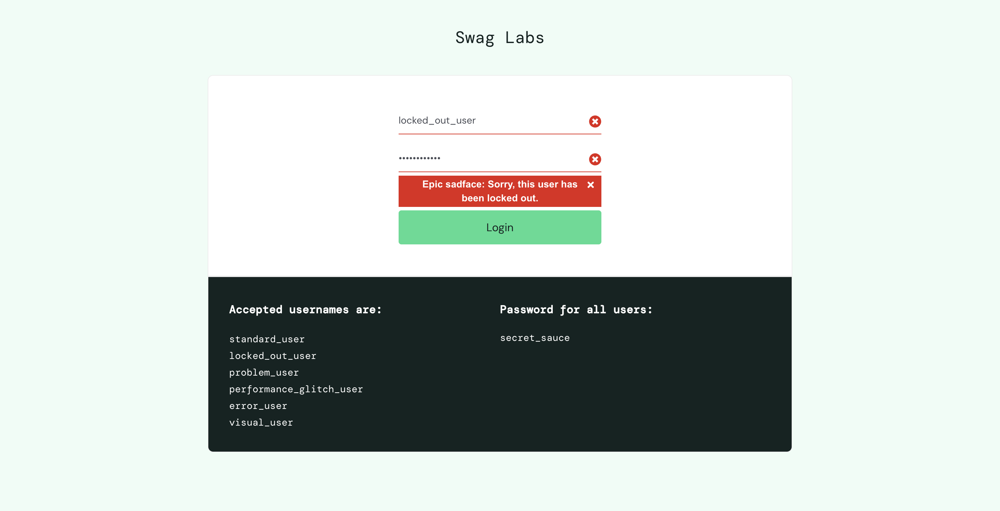

### ✅ 03 – Valid Login  
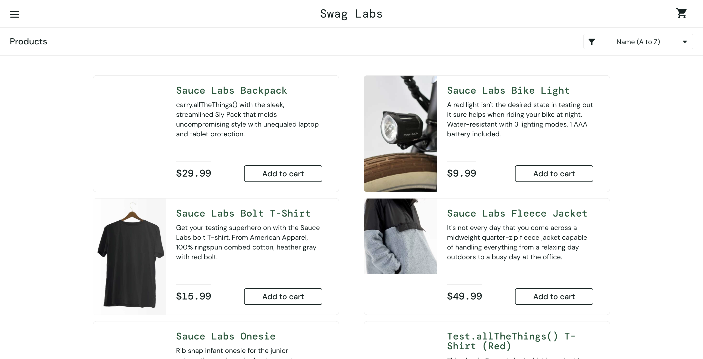

### ✅ 04 – Inventory Items Present  
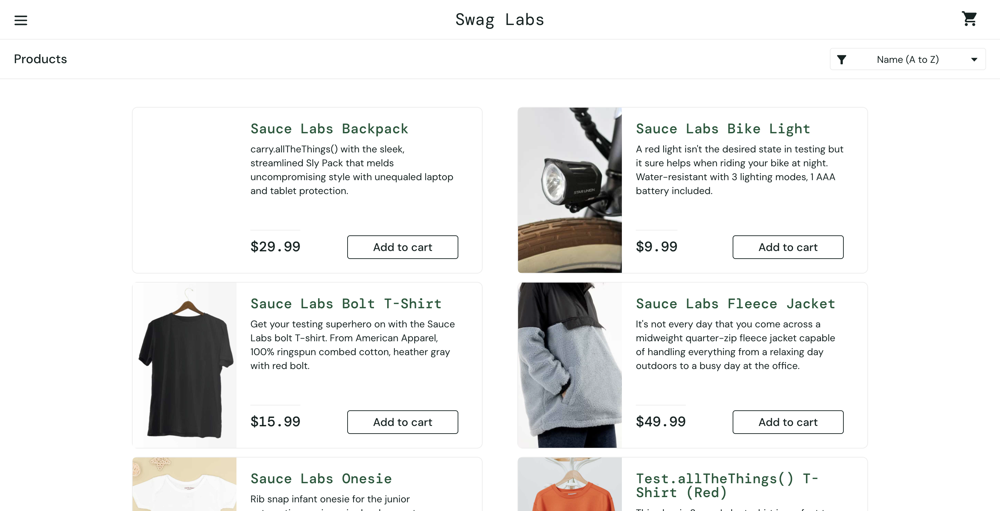

### 📸 05 – Logged In Screenshot  
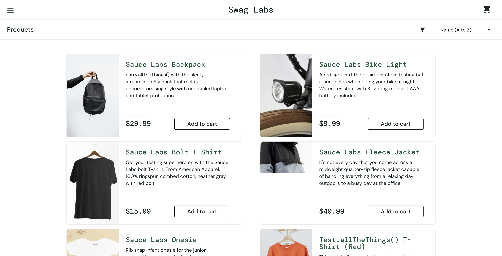

### 🛒 06 – Add to Cart  
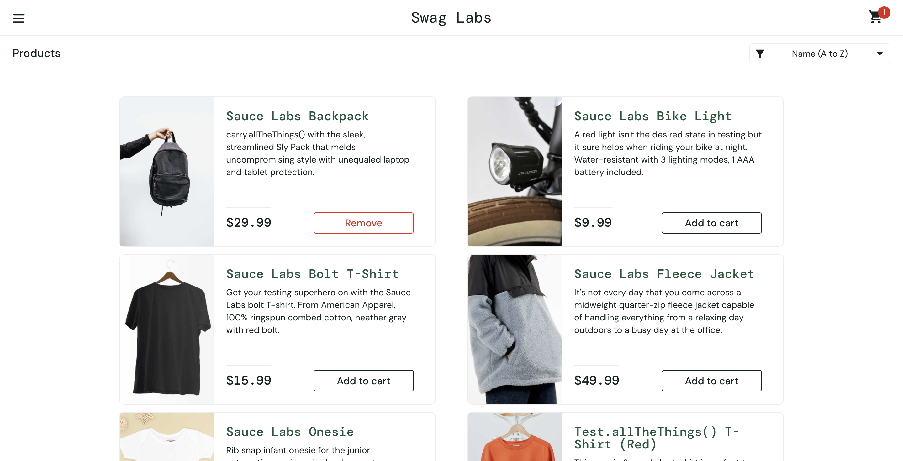

### 🛒 07 – Cart Badge Shows 1  


### 🔄 08 – Remove from Cart  
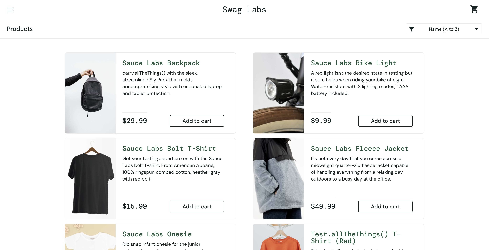

### 📦 09 – Navigate to Cart  
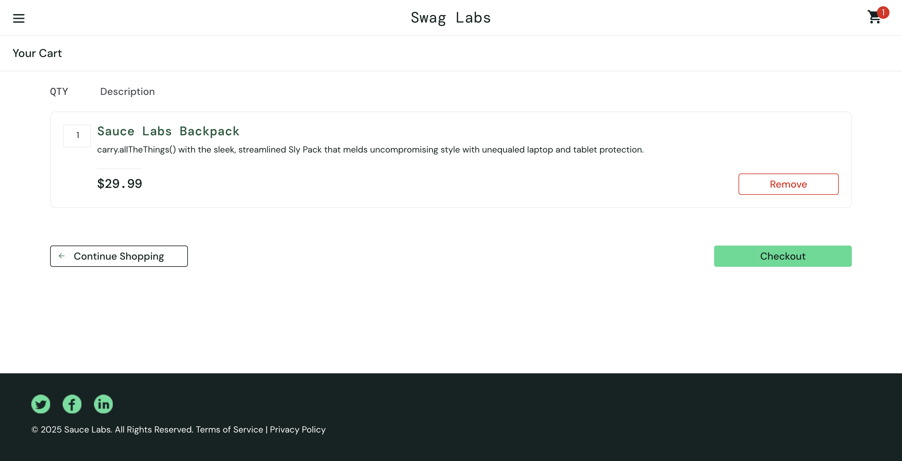

### 📦 10 – Cart Empty After Removal  
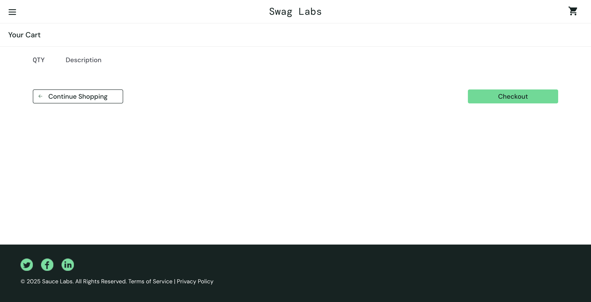

### 🔤 11 – Sort Name Z→A  
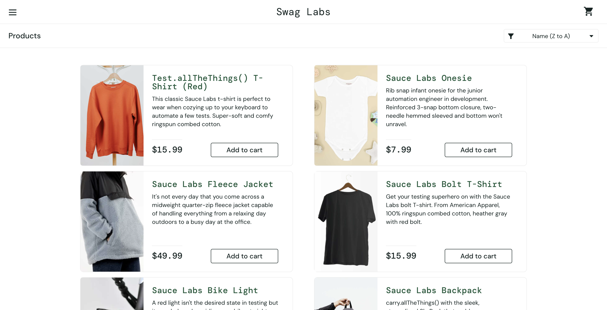

### 💲 12 – Sort Price Low→High  
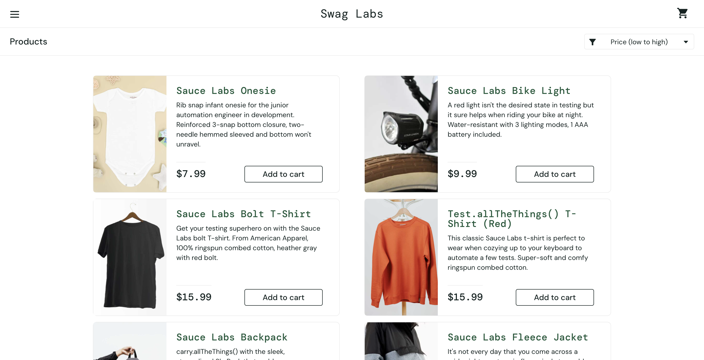

### 💲 13 – Sort Price High→Low  
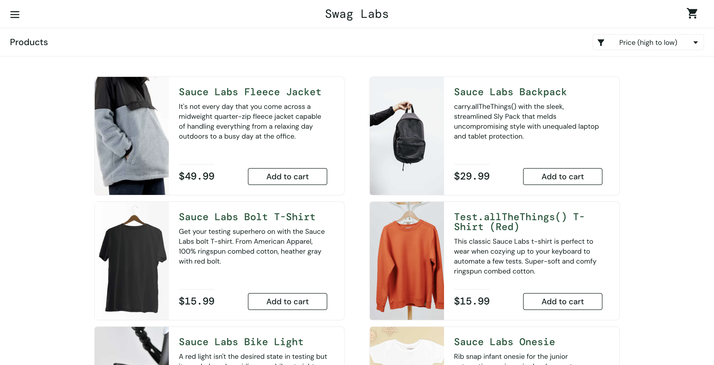

### 🧾 14 – Two Items to Checkout  
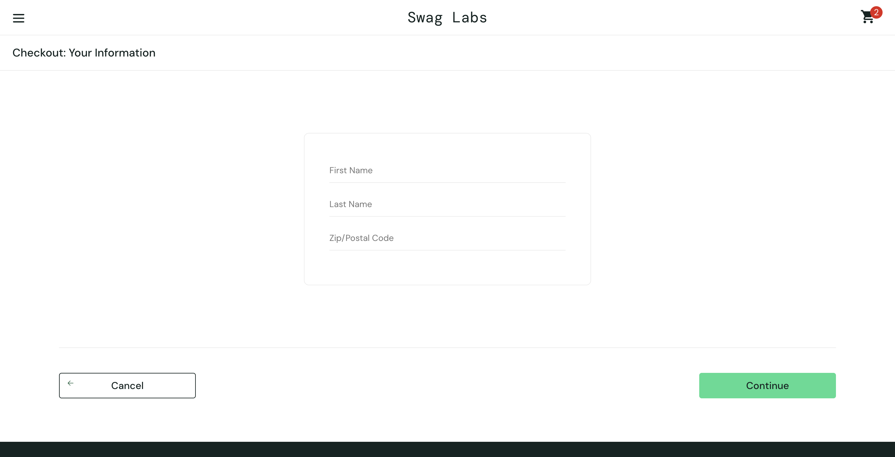

### ✅ 15 – Checkout Complete  
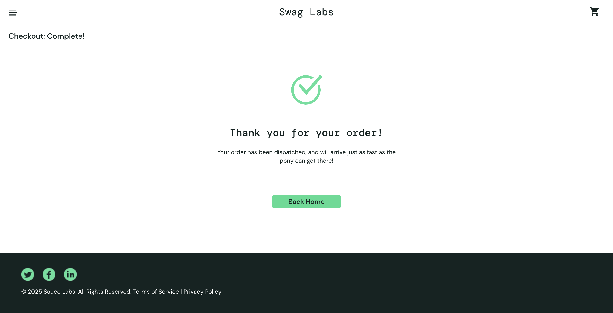

---

## 🚀 Run Locally

1. Install Python 3.x and Chrome
2. Clone this repository
3. Install dependencies:

```bash
pip install -r requirements.txt
```

4. Run tests:

```bash
pytest tests/
```

5. Screenshots will be saved automatically to `/screenshots/`
